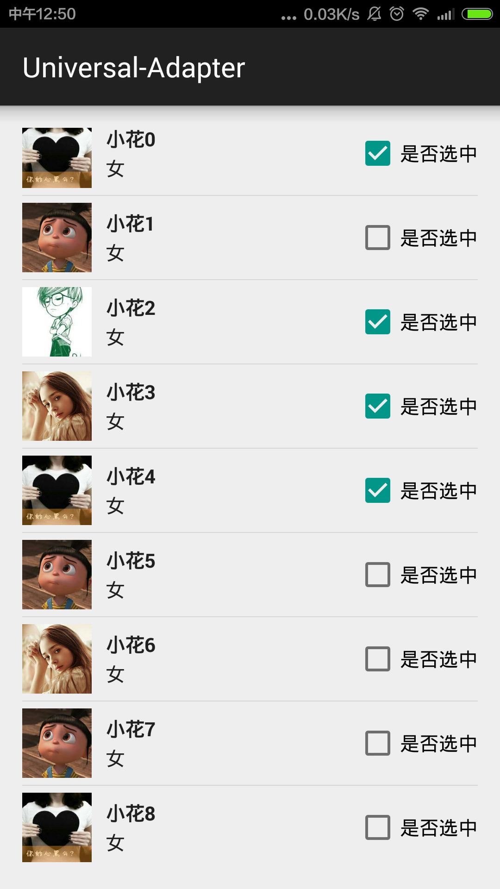

# Universal-Adapter
万能的Adapter,代码回去添加


- 普通的Adapter

```java
public class OldMyAdapter extends BaseAdapter {
    Context context;
    List<UserEntity> userEntities;
    LayoutInflater inflater;

    public OldMyAdapter(Context context, List<UserEntity> userEntities) {
        this.context = context;
        this.userEntities = userEntities;
        inflater=LayoutInflater.from(context);
    }

    @Override
    public int getCount() {
        return userEntities.size();
    }

    @Override
    public Object getItem(int position) {
        return userEntities.get(position);
    }

    @Override
    public long getItemId(int position) {
        return position;
    }

    @Override
    public View getView(int position, View convertView, ViewGroup parent) {
        final ViewHolder viewHolder;
        if (convertView==null){
            viewHolder=new ViewHolder();
            convertView=inflater.inflate(R.layout.listview_item,parent,false);
            viewHolder.icon= (ImageView) convertView.findViewById(R.id.listview_item_iv_icon);
            viewHolder.name= (TextView) convertView.findViewById(R.id.listview_item_tv_name);
            viewHolder.sex= (TextView) convertView.findViewById(R.id.listview_item_tv_sex);
            viewHolder.checkBox= (CheckBox) convertView.findViewById(R.id.listview_item_cb_checkBox);
            convertView.setTag(viewHolder);
        }else{
            viewHolder= (ViewHolder) convertView.getTag();
        }

        final UserEntity userEntity=userEntities.get(position);


        viewHolder.name.setText(userEntity.getName());
        viewHolder.sex.setText(userEntity.getSex());
        viewHolder.checkBox.setChecked(userEntity.isCheck());
        Ion.with(context).load(userEntity.getIcon()).intoImageView(viewHolder.icon);

        viewHolder.checkBox.setOnClickListener(new View.OnClickListener() {
            @Override
            public void onClick(View v) {
                userEntity.setIsCheck(viewHolder.checkBox.isChecked());
            }
        });

        return convertView;
    }

    public static class ViewHolder{
        TextView name,sex;
        ImageView icon;
        CheckBox checkBox;
    }

}
```

- Universal-Adapter

```java
public class NewMyAdapter extends UniversalAdapter<UserEntity> {

    public NewMyAdapter(Context context, List<UserEntity> datas) {
        super(context, datas,R.layout.listview_item);
    }

    @Override
    public void convert(ViewHolder holder, final UserEntity userEntity) {

        //这里使用链式编程，简化代码
        holder.setImage(R.id.listview_item_iv_icon, userEntity.getIcon())//设置头像
                .setText(R.id.listview_item_tv_name, userEntity.getName())
                .setText(R.id.listview_item_tv_sex,userEntity.getSex());

        //设置CheckBox
        final CheckBox cb=holder.getView(R.id.listview_item_cb_checkBox);
        cb.setChecked(userEntity.isCheck());

        //设置CheckBox的点击事件
        cb.setOnClickListener(new View.OnClickListener() {
            @Override
            public void onClick(View v) {
                userEntity.setIsCheck(cb.isChecked());
            }
        });
    }
}
```


